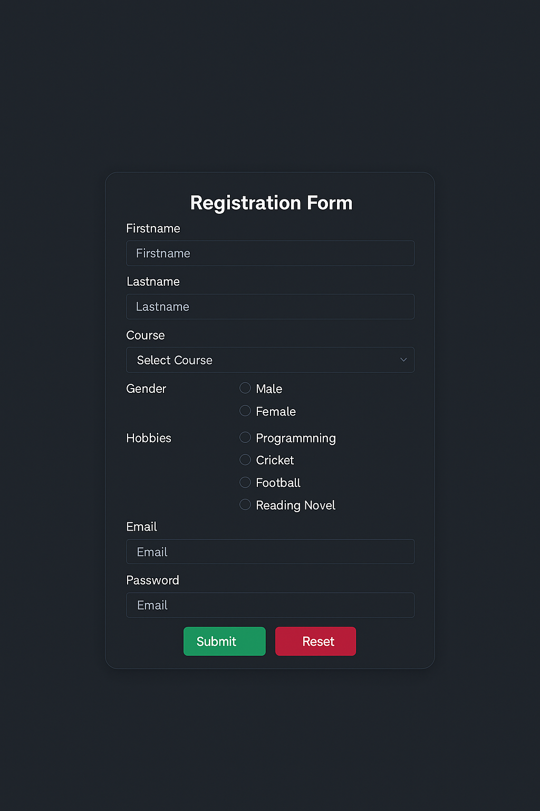

# 📝 Responsive Registration Form

A modern, responsive registration form built using **HTML, CSS, and JavaScript**, featuring:

- 🌗 Dark/Light mode toggle
- 🎓 Dynamic dropdown with specializations for B.Tech
- ✅ Client-side form validation
- 🎨 Custom styled dropdown with Font Awesome icons

---

## ✨ Features

- **Dark Mode Toggle:** Easily switch between light and dark themes using a toggle button.
- **Custom Dropdown:** Beautiful dropdown with a caret icon using Font Awesome.
- **Dynamic Specializations:** When "B.Tech" is selected, a second dropdown appears for selecting specializations.
- **Form Validation:** Email, password, and phone number validation with custom error messages.
- **Responsive Design:** Works well on all screen sizes and mobile devices.

---

## 📸 Preview

---

## 🛠️ Tech Stack

- **HTML5** – Structure of the form
- **CSS3** – Styling and responsive design
- **JavaScript (Vanilla)** – Form validation + dynamic dropdown + theme toggle
- **Font Awesome** – Icon for dropdown styling

